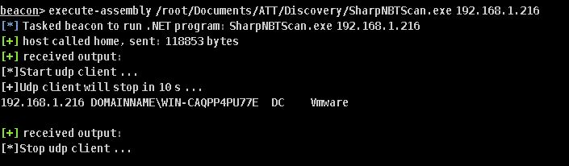

# SharpNBTScan
NetBIOS scanning tool written in C#
## Usage
```
Usage:
    .\SharpNBTScan.exe 192.168.0.1/24
```
## Example
Retrieve host info via NetBIOS 
```
Format: IP GroupName\HostName ServiceType DeviceType
    
```

